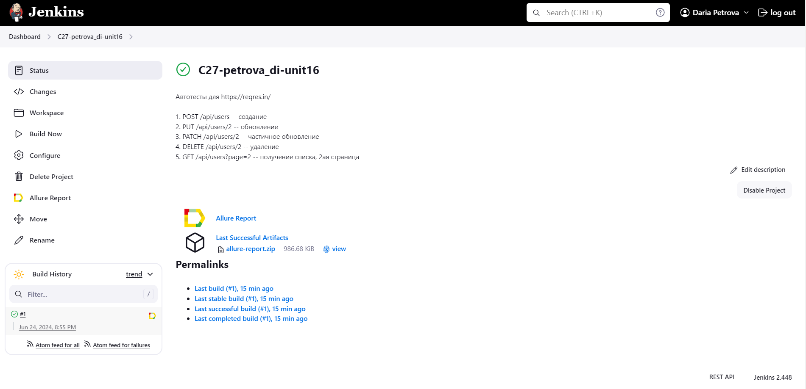
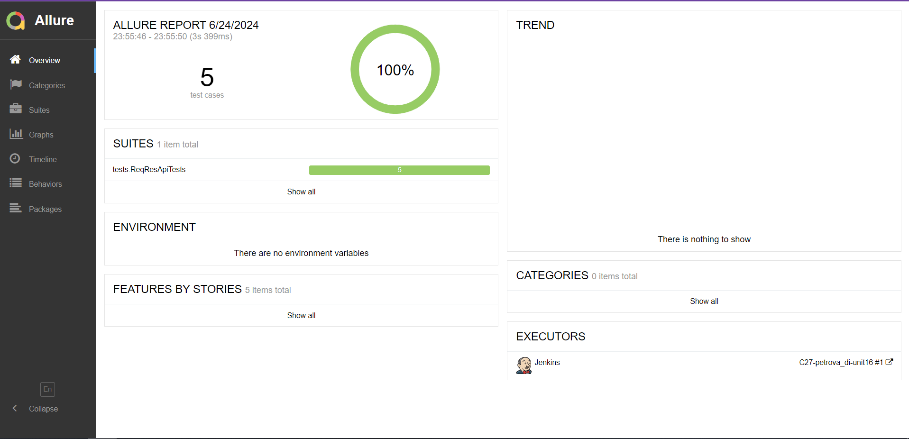
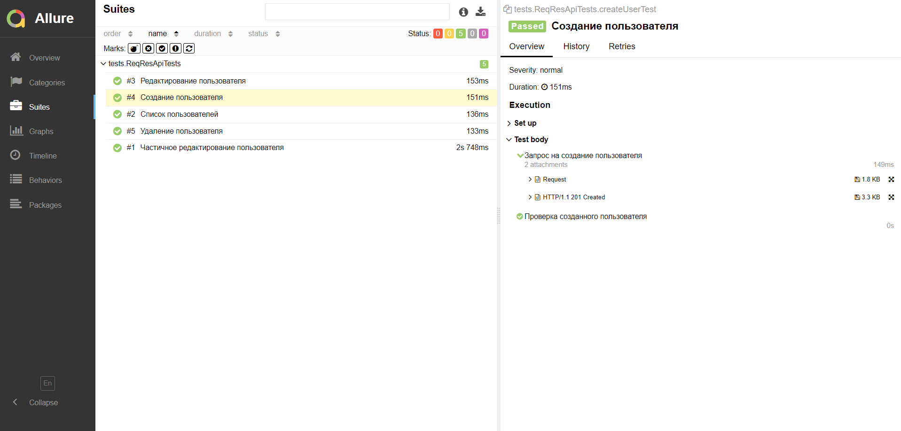
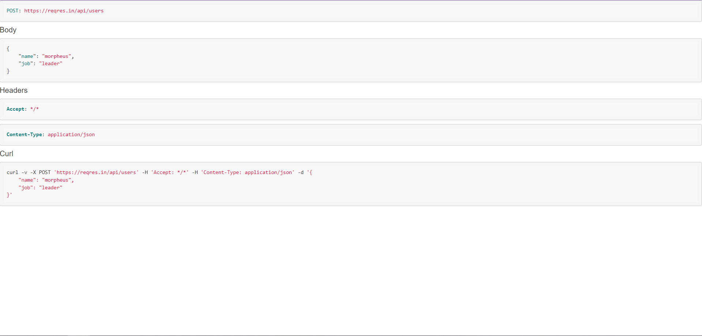
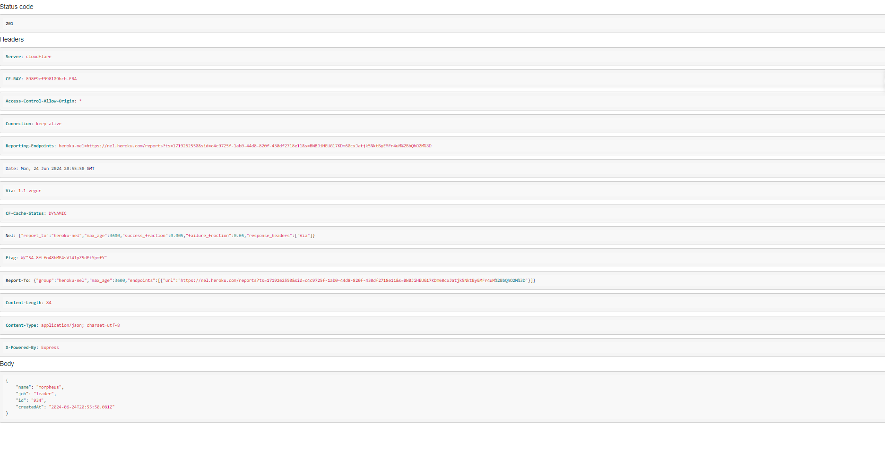
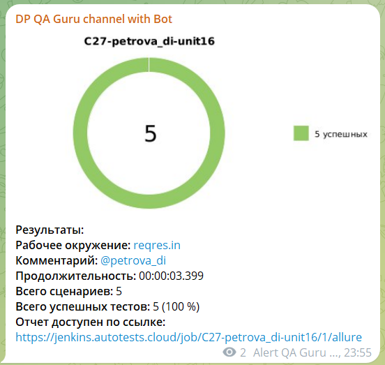

# Проект по автоматизации тестирования для [](https://reqres.in/)

## :scroll: Содержание
- [Используемый стек](#computer-используемый-стек)
- [Автоматизированные тесты](#ballot_box_with_check-api-тесты-для-пользователей)
- [Сборка в Jenkins](#-сборка-в-jenkins)
- [Allure-отчет](#-allure-отчет)
- [Уведомления в Telegram](#-уведомления-в-telegram)

## :computer: Используемый стек
<p align="center">
<a href="https://www.jetbrains.com/idea/"></a> 
<a href="https://www.java.com/"></a>
<a href="https://gradle.org/"></a> 
<a href="https://junit.org/junit5/"></a>
<a href="https://rest-assured.io/"></a>
<a href="https://projectlombok.org/"></a>
<a href="https://github.com/"></a>
<a href="https://github.com/allure-framework/allure2"></a>
<a href="https://www.jenkins.io/"></a> 
<a href="https://telegram.org/"></a>
</p>

Api автотесты:
- Реализованы на языке ```Java```
- В качестве сборщика используется ```Gradle```
- Используется фреймворк ```JUnit 5```
- Для удаленного запуска используется сборка в ```Jenkins```
- Для сборки формируется ```Allure Report```
- Результат отправляется в ```Telegram``` канал при помощи бота

Allure-отчет:
* Шаги теста
* Детали запроса
* Детали ответа

## :ballot_box_with_check: API тесты для пользователей

- ```POST /api/users``` -- создание
- ```PUT /api/users/2``` -- обновление
- ```PATCH /api/users/2``` -- частичное обновление
- ```DELETE /api/users/2``` -- удаление
- ```GET /api/users?page=2``` -- получение списка, 2ая страница

##  Сборка в Jenkins
[](https://jenkins.autotests.cloud/job/C27-petrova_di-unit16/)

### *Команды для запуска из терминала*

***Локальный запуск:***
```bash
gradle clean test
```

***Запуск в Jenkins:***
```java
clean test
```

Для запуска сборки необходимо:
1. Перейти в сборку
2. Нажать ```Собрать сейчас```/```Build now```

##  Allure-отчет
После выполнения сборки в блоке ```История сборок```/```Build History``` напротив конкретной сборки отображается значок
[](https://jenkins.autotests.cloud/job/C27-petrova_di-unit14/allure/),
при нажатии на который открывается страница со сформированным html-отчетом и тестовой документацией.

### *Главная страница отчета*
[](https://jenkins.autotests.cloud/job/C27-petrova_di-unit16/1/allure/)

### *Тест-кейсы*
[](https://jenkins.autotests.cloud/job/C27-petrova_di-unit16/1/allure/#suites)

### *Детали запроса*
[](https://jenkins.autotests.cloud/job/C27-petrova_di-unit16/1/allure/#suites)

### *Детали ответа*
[](https://jenkins.autotests.cloud/job/C27-petrova_di-unit16/1/allure/#suites)


##  Уведомления в Telegram
После завершения сборки специальный бот, созданный в ```Telegram```, автоматически обрабатывает и отправляет сообщение с отчетом о прогоне тестов.

[]()
